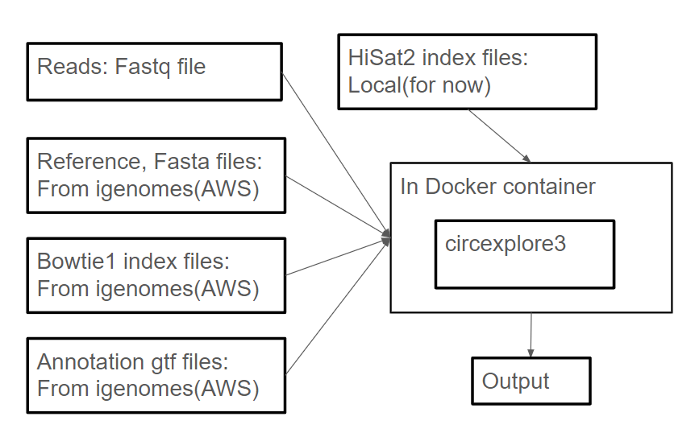

# Intro
* This is a nextflow pipeline for circexplore3; 
* The original circexplore3: https://github.com/YangLab/CLEAR

# Basic Structure


# Quick Start
## 1. **prepare sample list**

| sample | fastq_1 | fastq_2 |
|--------|---------|---------|
| group1 | /toy_data/1000-minus_215_362_S155_L003_1.fastq.gz | /toy_data/1000-minus_215_362_S155_L003_2.fastq.gz |
| group2 | /restricted/projectnb/casa/mtLin/nf_core_cirRNA/toy_data/1001-minus_204_373_S148_L003_1.fastq.gz | /restricted/projectnb/casa/mtLin/nf_core_cirRNA/toy_data/1001-minus_204_373_S148_L003_2.fastq.gz |

- You can find an example at ```/example/samplelist.csv```

## 2. run command
```
nextflow run main.nf -dump-channels -profile singularity --input path/to/samplelist.csv --genome GRCh38
```

# About maintenance
- ### When new reference/index is availiable, please update the conf/igenomes.config
- ### For example
```
genomes {
    'GRCh37' {
    fasta       = "${params.igenomes_base}/Homo_sapiens/Ensembl/GRCh37/Sequence/WholeGenomeFasta/genome.fa"
    fasta_fai   = "${params.igenomes_base}/Homo_sapiens/Ensembl/GRCh37/Sequence/WholeGenomeFasta/genome.fa.fai"
    bwa         = "${params.igenomes_base}/Homo_sapiens/Ensembl/GRCh37/Sequence/BWAIndex/version0.6.0/"
    bowtie      = "${params.igenomes_base}/Homo_sapiens/Ensembl/GRCh37/Sequence/BowtieIndex/"
    bowtie2     = "${params.igenomes_base}/Homo_sapiens/Ensembl/GRCh37/Sequence/Bowtie2Index/"
    star        = "${params.igenomes_base}/Homo_sapiens/Ensembl/GRCh37/Sequence/STARIndex/"
    gtf         = "${params.igenomes_base}/Homo_sapiens/Ensembl/GRCh37/Annotation/Genes/genes.gtf"
    bed12       = "${params.igenomes_base}/Homo_sapiens/Ensembl/GRCh37/Annotation/Genes/genes.bed"
    mature      = "${params.igenomes_base}/Homo_sapiens/Ensembl/GRCh37/Annotation/SmallRNA/mature.fa"
    mito_name   = "MT"
    species_id = "hsa"
    }
}
```
* ### When GRCh38 is availible, add the new part into genomes object
```
'GRCh38' {
        fasta       = "${params.igenomes_base}/Homo_sapiens/NCBI/GRCh38/Sequence/WholeGenomeFasta/genome.fa"
        fasta_fai   = "${params.igenomes_base}/Homo_sapiens/NCBI/GRCh38/Sequence/WholeGenomeFasta/genome.fa.fai"
        bwa         = "${params.igenomes_base}/Homo_sapiens/NCBI/GRCh38/Sequence/BWAIndex/version0.6.0/"
        bowtie      = "${params.igenomes_base}/Homo_sapiens/NCBI/GRCh38/Sequence/BowtieIndex/"
        bowtie2     = "${params.igenomes_base}/Homo_sapiens/NCBI/GRCh38/Sequence/Bowtie2Index/"
        star        = "${params.igenomes_base}/Homo_sapiens/NCBI/GRCh38/Sequence/STARIndex/"
        gtf         = "${params.igenomes_base}/Homo_sapiens/NCBI/GRCh38/Annotation/Genes/genes.gtf"
        bed12       = "${params.igenomes_base}/Homo_sapiens/NCBI/GRCh38/Annotation/Genes/genes.bed"
        mature      = "${params.igenomes_base}/Homo_sapiens/NCBI/GRCh38/Annotation/SmallRNA/mature.fa"
        mito_name   = "chrM"
        species_id = "hsa"
        }
```
### You can find those infomation on [igenomes](https://github.com/ewels/AWS-iGenomes)

# About docker container
* ### You do not have to generate a container by yourself, it is already pushed to ```dockerhub```
* ### If you want to regenerate/redesign the container, you can find my define files at ```dockerfile```

# Todo
- [x] Single sample test
- [ ] Multiple samples test - on going
    ```
    nextflow run testing_DCC.nf -dump-channels -profile singularity --input /restricted/projectnb/casa/mtLin/sambabi/mice_circRNA/raw_data/sample_list.csv --genome GRCm38
    ```
- [ ] make hiSat2 index online/ or generate without any user-end operation
- [ ] Delete fastq file after analysis